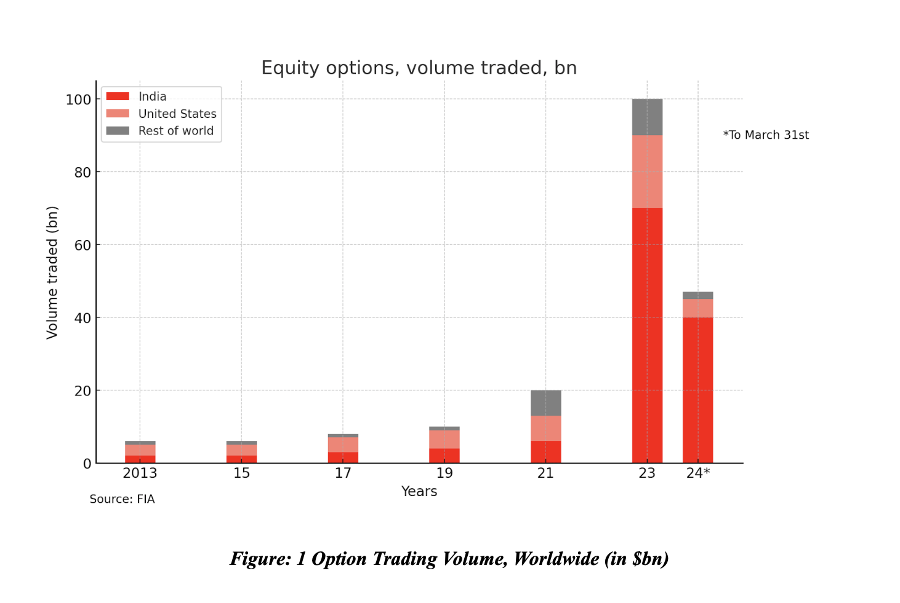

# Econometrics Final Project "Options Term Structure with the Principal Component Analysis"

**Alessia Piacitelli, Abhinav Mangat**  
New York University  
ECON-UB 251: ECONOMETRICS  
Professor Sebastiano Manzan  
May 14th, 2024

---

## Abstract

This project investigates the options term structure for the National Stock Exchange of India using Principal Component Analysis (PCA). The term structure of options refers to the relationship between the prices of options and their maturities, providing crucial insights into market expectations and risk assessments. By analysing the clustering of options by industry and examining volatility patterns relative to days until expiry, we aim to uncover the latent structures influencing option pricing and investment strategies. We divided our dataset into estimation and testing segments and performed industry-specific analyses to reveal unique informational structures within each sector. Subsequently, we develop and test a trading strategy based on these components, focusing on sectors such as Technology & Telecommunications, Financial Services, and Manufacturing & Engineering. Our findings suggest that specific industries exhibit distinct patterns that can be leveraged to predict option prices and inform trading decisions. However, the model's predictive power is somewhat limited by data challenges and noise. This study underscores the potential of PCA in financial market analysis and provides a foundation for future research to enhance predictive accuracy and trading strategies.

---

## Introduction

The landscape of financial markets is continually shaped by the dynamic interplay of myriad factors ranging from macroeconomic policies to investor psychology. In this project, we perform the study of the options term structure for the National Stock Exchange of India. In recent years, the Indian National Stock Exchange has emerged as a powerhouse for options trading, surpassing even the most prominent global financial markets. Remarkably, they accounted for over 78% of the total options trading volume in 2023, solidifying India's position as a dominant player in the derivatives landscape (Mandavia, 2024). This rapid growth in options trading volume underscores the importance of understanding the underlying structures and factors influencing this market.



Our study is motivated by the hypothesis that given a vast amount of daily information, it is possible to reduce this flow into fewer components that are able to summarise the moving factors of the market through the means of the Principal Component Analysis (PCA) and use them to predict the prices of option contracts. By analysing the clustering of options based on industry, and delving into the patterns of volatility relative to days until expiry, this project aims to uncover latent structures that govern option pricing and investment strategies in the Indian financial landscape. To navigate through this analysis, we will employ a methodological framework incorporating Static Principal Component Analysis (PCA). This approach will enable us to identify significant patterns from the noise, offering insights into the principal drivers that shape the dynamics of the options market. Our exploration is underpinned by a rich dataset that spans various dimensions of options trading, such as strike prices, settlement prices, and the number of contracts.

---

## Data

For this study, data collection posed a significant challenge in terms of processing and accessibility. Initially, we had access to daily data spanning the 2000-2020 period for Futures and Options, totaling over 112 million observations. To overcome processing limitations, we adopted a strategy of lazy loading and chunk processing, leveraging the multiprocessing package in Python. Focusing specifically on options, we narrowed our scope to include only OPTIDX and OPTSTK instruments, ensuring comparability in scale and aggregating effects. This refinement allowed us to reduce our dataset to 1,021,254 observations spanning the period from 2019-11-25 to 2020-05-25.


At this juncture, the limitations posed by the data primarily revolved around its size and frequency. While initially, the extensive size and high frequency of the data appeared promising for our study, they presented significant challenges. The sheer size of the dataset undermined our ability to obtain a clear and transparent understanding of the underlying patterns. Moreover, the high frequency introduced considerable noise into the data, complicating our analysis. Furthermore, conducting additional exercises with such a dataset would have necessitated data rolling, which proved to be a challenge given the aforementioned limitations.

---

## Exploratory Data Analysis

Initially, through various graphical representations, we aim to convey not only the statistical outputs of our analyses but also the underlying patterns and insights that emerge from our data. This section will guide through a series of visualisations, each designed to highlight different aspects of market behaviour and the effects of economic variables. The insights gleaned from these analyses inform the subsequent sections of our study, particularly in identifying which industries offer the most explanatory power in the PCA and regression analyses.

The bar chart [Figure 3.1] showcases the number of contracts per industry, revealing significant variation in market participation across sectors. The Technology & Telecommunications sector dominates with the highest number of contracts, exceeding 250,000. This is followed by the Manufacturing & Engineering and Financial Services sectors, each with substantial contract counts, highlighting their critical roles in the market. Conversely, industries such as Media, Entertainment, and Chemicals display minimal contract activity, indicating less engagement or lower market interest in these sectors. This disparity in contract distribution underscores the varying levels of investor confidence and market activity across industries. High contract volumes in sectors like Technology & Telecommunications may reflect rapid innovation and growth, attracting more traders. In contrast, lower volumes in sectors such as Media and Chemicals suggest either market saturation or lesser perceived profitability. Understanding these patterns is crucial for developing targeted trading strategies, as it helps identify sectors with high liquidity and potential for better returns.


Next, the volatility time series [Figure 3.2] revealed that there isn't a consistent trend indicating that volatility uniformly increases or decreases during any particular day or month. However, the data reveals significant fluctuations in market volatility, particularly during the peak of the COVID-19 pandemic. During the early months of 2020, average daily volatility remained relatively low and stable. However, starting in March 2020, coinciding with the global escalation of the COVID-19 crisis, volatility surged dramatically. This period marked by heightened uncertainty and rapid changes in market conditions saw average daily ranges exceeding 140, indicating extreme market reactions and investor behaviour driven by pandemic-related news and economic impacts.


The graph [Figure 3.3] indicates a high degree of volatility in options with very few days to expiry, peaking dramatically at several points. Notably, there are significant volatility spikes at approximately 0, 100, 200, and 300 days to expiry. These peaks suggest that certain intervals before expiration are associated with heightened market activity and uncertainty. Volatility tends to be lower and more stable in the intermediate periods between these spikes, indicating periods of relative market calm. The reasons for these volatility peaks could be manifold, including the release of market-moving news, earnings reports, or other economic events that coincide with these intervals. Understanding these volatility patterns is crucial for traders and investors. The spikes near expiration dates highlight the increased risk and potential for rapid price movements as contracts near their expiry, necessitating more vigilant risk management and strategic planning. These insights also underscore the importance of considering the time to expiry as a critical factor in options trading strategies, as it significantly influences volatility and, consequently, the pricing and risk of options contracts.


Because we aim to uncover specific patterns and detailed insights, we conducted industry-specific analysis, delving into the unique volatility dynamics within different sectors. The first graph [Figure 3.4] illustrates the average daily volatility against the days to expiry for options in the Financial Services sector. Notably, there is a significant peak in volatility around 20 days to expiry, where the average daily volatility rises to approximately 18. This suggests a period of heightened market uncertainty and increased trading activity as options approach this critical threshold. Volatility then sharply declines after this peak but remains elevated until around 40 days to expiry, after which it stabilises at lower levels. The pattern indicates that as options near their expiry, market participants in the Financial Services sector may engage in more aggressive trading or hedging activities, leading to increased price fluctuations.


The second graph focuses on the Media sector, showing the average daily volatility against the days to expiry. Similar to the Financial Services sector, a distinct peak in volatility is observed around 20 days to expiry, reaching approximately 6. This spike suggests increased trading activity or market reactions to specific events as options approach this expiration window. After this peak, volatility decreases steadily, with occasional minor spikes, and stabilises at lower levels as the expiry date approaches. The volatility pattern in the Media sector indicates that significant price movements are concentrated in the period leading up to the 20-day mark, potentially driven by sector-specific news or market sentiment shifts.


The scatter plot above depicts the 20-day moving average of closing prices against the days to expiry for options contracts. The data points reveal an intriguing pattern in how the moving average of closing prices evolves as options approach their expiration dates. It appears that the moving average tends to stabilise as the days to expiry increase. In the initial periods, especially within the first 40 days, there is significant fluctuation and higher variability in the moving average of closing prices. This high volatility during the early stages could be attributed to market participants' speculative activities and rapid reactions to market news or events.

As the days to expiry extend beyond 40 days, the moving average shows a tendency to become more stable and less volatile. This stabilisation might suggest a correlation between the days to expiry and the moving average closing prices, indicating that as options approach their expiration, market prices settle into more predictable patterns. This could be due to decreased uncertainty and reduced speculative trading as the expiration date approaches, leading to a convergence towards the intrinsic value of the options.


---

## Static Principal Component Analysis

In this section, the goal is to explore the informational content of the dynamics of futures term structure over a wide range of industries taking into account trading maturities up to 12 months. For this, we have first standardised

- Strike price
- Closing price
- Settlement price
- Number of contracts
- Value of contracts in lakh
- Change in open interest
- Days to expiry
- 
It is important to note that we did not include returns. Firstly, they are non-investable as
they are not available for investors unless the contract expires; secondly, we would need rolled data for such a calculation.
Additionally, we have separated the original dataset into 14 sections by industry. Next, we have proceeded to perform the PCA on each dataframe to identify for which industries this analysis will have the most explanatory power and could be implemented in the regression to develop our trading strategy.

### Theory and Methodology

Denoting time as t = 1...T and letting p be the number of variables, we create a (T x 1) vector x.
Next, since the variables are influenced by the same driving forces, we create p artificial variables - components - as linear combinations of the x vectors orthogonal (perpendicular) to each other, and they reproduce the original variance-covariance of the data reducing noise at the same time. The first component is constructed so that it explains as much variability as possible, the second one explains the rest of the variance, but, additionally, it is not correlated with the first component, and so on. Thus, the analysis turns out to be a maximisation problem, which we solve by finding the first order condition


Where 𝝺 is the Langrange multiplier and I is the (p x p) identity matrix. Through the above equation, the PCA calculates the eigenvalues (𝝺) and the eigenvectors A of the variance-covariance matrix X’X. The variance explained by the i-th component is given by the i-th eigenvalue divided by the sum of all the eigenvalues:


This allows us to quantify the significance of the PCs identified.
Following the methodology of Frachot, Jansi and Lacoste (1992) and Duerr and Voegeli (2009), we perform an ADF test for the variables of interest for stationarity to get more reliable PCA results; we find that they are indeed stationary and proceed to conduct the PC analysis over our dataset.


### Results
With the help of PCA, we identify the main drivers of stochastic processes of stock options. This is however significant only for 4 clusters (which we find through the eigenvalue test: for eigenvalues 𝝺 < 1 the PC explains less than a single original variable):
- Financial Index: 3 components;
- General Index: 4 components;
- Manufacturing & Engineering: 1 component;
- Technology & Telecommunications: 1 component.
The components combine the explanatory power of several variables and can be used as better predictors of the price of the regression, to get an estimate of the signals predicting the price.


### Interpretation

These findings delve into the essential characteristics of the significant components identified across various industries.
1. Financial Index: This index, encompassing a broad spectrum of entities listed on the National Stock Exchange of India, revealed intriguing insights. PC1 is indicative of trading volume, representing the sheer magnitude of contracts traded. PC2 and PC3, on the other hand, encapsulate the closing and settlement prices, serving as barometers for market sentiment. These metrics wield substantial influence over market dynamics, dictating supply-demand dynamics and liquidity, pivotal for contract operations.
2. General Index: Tracking numerous listed companies, the analysis uncovered four principal components of note. Volume emerges as a dominant factor across PC2 and PC3, underscoring its role as a key aggregator. Moreover, the presence of variables such as days to expiration, closing, and settlement prices within these components suggests an incorporation of maturity and trader sentiment into the equation.
3. Manufacturing & Engineering Industry: Within this sector, the PCA unveiled a singular significant component revolving around the strike price. This revelation provides valuable insights into the risk tolerance prevailing among traders engaging with options. The strike price emerges as a pivotal indicator, reflecting the risk appetite of traders and investors alike. This underscores the critical role of strike price selection in shaping trading strategies and risk management approaches within the Manufacturing & Engineering Industry.
4. Technology & Telecommunications Industry: Notably, the sole significant component identified in this domain revolves around the change in open interest. This underscores the pivotal role of liquidity in the dynamics of option contract trading within the Technology & Telecommunications sector.


## Regression analysis with PCA
Having identified the industries of interest and having formulated the Principal Components that aggregate the variance of the initial variables, we run a linear regression to predict prices using our principal components for portfolios comprising contracts from the two indices and the two industries identified in the eigenvalue test for significance.
We regress using the following formula:


And obtain the following results:


PC# stands for Principal Component #
FI stands for Financial Index
GI stands for General Index
ME stands for Manufacturing & Engineering
TT stands for Technology & Telecommunications (base group here) The regression was performed on the

Overall, the model has some predictive power but also shows signs of potential issues, however the coefficients turn out to be complicated to interpret. The very high value of these coefficients and standard errors may indicate scaling issues or the presence of outliers (Options for the stock and the index options have different price categories - a further study could explore this issue). The significant F-statistic suggests that the model as a whole has some explanatory power, although the results suggest that more would have to be done to match the results with financial reasoning assumptions. The residuals of the model do not appear to be normally distributed, which could affect the reliability of the coefficient estimates and standard errors. We opted to use clustered standard errors since we did in fact work with clusters and suspected stronger correlation within clusters and thus, the violation of the independence assumption.

## Trading Strategy: Formulation and Test

Based on the results from our exploratory data analysis, principal component analysis and regression analysis, we propose a trading strategy that leverages the principal components identified for different industries. The strategy focuses on exploiting the predictive power of these components to optimise trading decisions for options on the National Stock Exchange of India. Considering that we do not include leveraged strategies in our analysis, we do not expect high returns, at least at this first stage study.


In this case, a lower Mean Squared Error of 0.00392 indicates that the model's predictions are closer to the actual values on average. The Root Mean Squared Error (the square root of the MSE), measures the average magnitude of the errors in the predicted values. Lower RMSE, also indicates better model performance. The Mean Absolute Error measures the average absolute difference between the predicted values and the actual values (here it supports the inferences made by MSE and RMSE). Although the R2 (equal to the Adjusted-R2 because of the size of the sample) indicates that only 11.3% of the variance is explained, we are not too worried about that as it often happens with financial data, especially in daily samples. Overall, the test seems to produce successful results, however, further investigation of the entire model would be advised for more robust findings.

### Industry-Specific Component Utilisation

Based on the analysis, we have outlined a trading strategy for the General Index (Nifty 50) and Financial Index (Bank Nifty), including buy and sell signals, as demonstrated below.
1. Financial Index
Principal Components Utilised: PC1 (Trading Volume), PC2 (Closing Prices), and PC3
(Settlement Prices).
Trading Strategy: Use PC1 to gauge market activity and liquidity, while PC2 and PC3 will help identify market sentiment and price trends.
- Buy Signal: When PC1 shows an increase in trading volume along with rising PC2 and PC3, indicating growing market interest and positive sentiment.
- Sell Signal: When PC1 shows decreasing trading volume with declining PC2 and PC3, suggesting falling market interest and negative sentiment.
2. General Index

### Principal Components Utilised: Four components including trading volume, days to expiration, closing prices, and settlement prices.

Trading Strategy: Focus on components related to trading volume and maturity to inform entry and exit points.
- Buy Signal: Increasing trading volume (PC2 and PC3) and positive price trends as options approach maturity.
- Sell Signal: Decreasing trading volume and negative price trends as options near expiration.
Similarly, the methodology applied to the Financial and General Indices can be extended to other sectors and industries. By adapting the same analytical approach—identifying key principal components that reflect crucial market dynamics—we can develop tailored trading strategies for different sectors. For each industry, principal components such as trading volume, price trends, and maturity indicators could be assessed to generate buy and sell signals that are specific to the market characteristics of that sector


## Limitations of the Study
In this study, we faced several challenges that affected our results. First, the dataset we used was large and updated very frequently, which brought a lot of extra noise and made it tough to spot clear patterns. This made processing the data quite challenging and sometimes obscured important insights. Also, our study only covered a short time frame—six months for gathering data and three months for testing. This brief period might not have been enough to detect long-term trends or unusual events, potentially limiting the reliability of our conclusions. Another issue was the need to continually update or "roll" our data for additional analysis, which was tricky because of the dataset’s large size and complexity. Although our tests confirmed that our data didn't show any problematic trends that could skew results, the unpredictable nature of financial markets could still weaken the findings from our analyses. Additionally, we encountered some technical hitches in our regression analysis—specifically, the high coefficients and standard errors suggested that there might be scaling issues or outliers in the data, making it hard to interpret our results clearly. All these factors mean we have to be careful about how we interpret and use the findings from this study.

Conclusion
The Principal Component Analysis has proven to be an effective method for analysing the dynamics of stock and index options term structures. The high explanatory power of the first principal components highlights their significance in capturing the majority of the variance in the data, primarily driven by strong price movements and changes in volume, supply, and demand. Our analysis shows that investment strategies leveraging the information embedded in the term structure can generate superior returns compared to basic strategies like the front-roll-at-expiration. Future research could extend this analysis by incorporating longer maturities and a broader range of commodities to enhance the robustness of the PCA results. Additionally, refining the strategy making process to include other factors and exploring the impact of macro factors and correlation effects could provide deeper insights into optimising investment strategies. Furthermore, other grouping approaches as well as the exploration of contango and backwardation could come in handy when broadening the potential of the study and of the methodology. Despite being imperfect and containing flaws such as unaddressed bias, multicollinearity, and look-ahead bias, this study sets the ground for further exploration of such kind and uncovers the potential of PCA in financial market analysis and sets the stage for future advancements in this area.


## References
1. Mandavia. (2024, March 11). India accounted for a staggering 78% of equity options contracts traded in 2023. Wall Street Journal. Retrieved May 14, 2024, from https://www.wsj.com/finance/stocks/eighty-percent-of-the-worlds-stock-options-arent-tra ded-where-you-think
2. Dürr, R., & Voegeli, M. (2009, January 1). Structural Properties of Commodity Futures Term Structures and Their Implications for Basic Trading Strategies. Social Science Research Network. https://doi.org/10.2139/ssrn.1605211

---

## Acknowledgements

We would like to extend our gratitude to Professor Sebastiano Manzan for his  guidance and support throughout this project. We also appreciate the assistance provided by our classmates and the resources offered by New York University.

---

## Appendices

### Appendix A: Data Processing Code

```python
import pandas as pd

# Sample data processing code
data = pd.read_csv('options_data.csv')
processed_data = data.dropna().reset_index(drop=True)
processed_data.to_csv('processed_options_data.csv', index=False)
